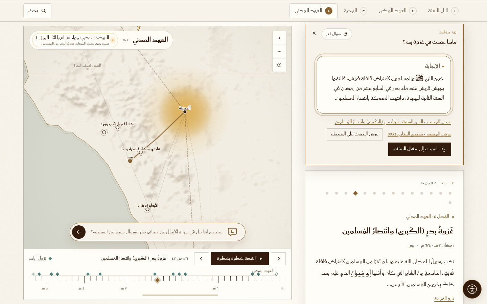
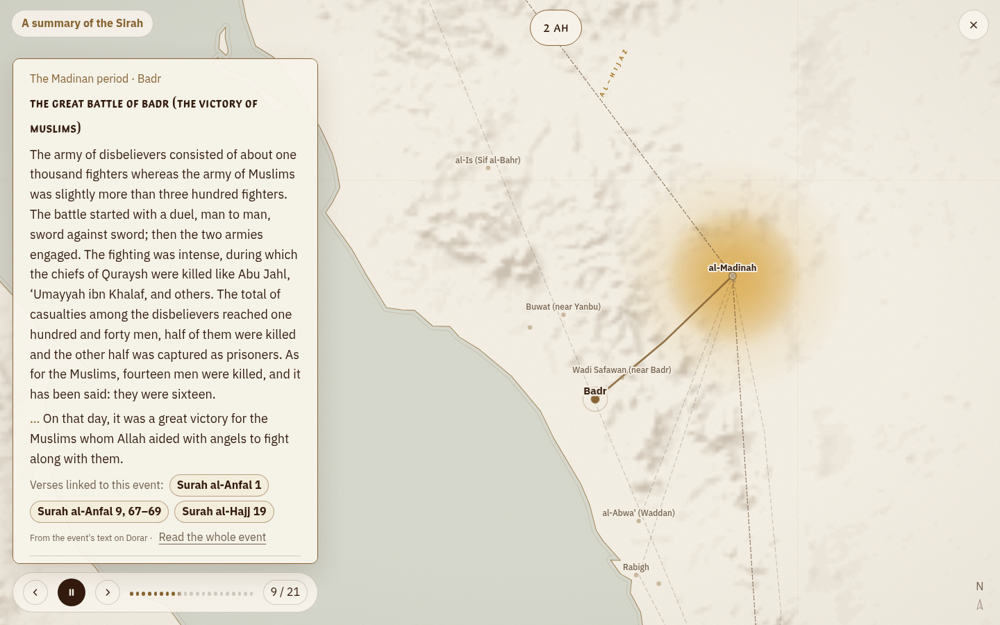

<div dir="rtl">

# بداية · Bidaya

**خريطة تفاعلية مدعومة بالذكاء الاصطناعي تعرّف بالإسلام من خلال سيرة النبي ﷺ: قصة متصلة في الزمان والمكان، مرتبطة بنزول القرآن الكريم، ومساعد ذكي يجيب من المصادر المعتمدة بالعربية والإنجليزية.**

تحدي الذكاء الاصطناعي في خدمة المحتوى الإسلامي · **المسار الثالث: التجارب التفاعلية والرحلة المعرفية للتعريف بالإسلام وتعلمه**

</div>

| | |
|---|---|
| **النموذج الحي · Live demo** | **<https://bidaya-sirah.vercel.app>** |
| **الفيديو التوضيحي · Demo video** | VIDEO_LINK |
| **عرض الفكرة · Proposal deck** | [`docs/proposal/بداية_مقترح_الفكرة.pptx`](docs/proposal/) |
| **نتائج الاختبار · Evaluation** | [`docs/evaluation/`](docs/evaluation/README.md) |

> **السؤال الأول قد يتأخر:** المساعد يعمل على معالج رسومي سحابي ينام عند عدم الاستخدام؛ يوقظه فتح الموقع، وقد يستغرق أول جواب حتى دقيقة، ثم 5–8 ثوانٍ لكل جواب.
> *The first answer may take up to a minute while the assistant's GPU wakes up; then 5–8 s per answer.*



<div dir="rtl">

## المشكلة

السيرة النبوية من أوضح الطرق لفهم الإسلام، وكثير من آيات القرآن نزلت في مواقف منها. لكن كتبها طويلة ومفصّلة، فيصعب على من يتعرف على الإسلام (غير المسلمين والمسلمين الجدد) ربط أحداثها بأماكنها، وفهم سياق آياتها، ومعرفة الموثوق منها.

## الحل

- **قصة على الخريطة:** 142 حدثًا من الموسوعة التاريخية في الدرر السنية، مرتبة في أربعة فصول، كل حدث في مكانه على خريطة الجزيرة العربية مع مساراته (الهجرة، الغزوات، الرسائل والوفود)، وشريط زمني، و«القصة خطوة بخطوة».
- **السور في سياقها:** 94 سجلًا يربط الآيات بأحداثها من الصحيحين وموسوعة التفسير، مع درجة الدليل ورابطه.
- **الأشخاص:** 98 شخصًا (صحابة وغيرهم) بنبذ موثقة، وكل اسم في النص يفتح بطاقته.
- **اسأل الخريطة (الذكاء الاصطناعي):** سؤال بالعربية أو الإنجليزية، فجواب قصير من المصادر المعتمدة مع روابطها، وتنتقل الخريطة إلى الحدث المقصود أو تُفتح بطاقة الشخص الذي سُئل عنه. يفهم أسئلة المتابعة («ومن قادها؟»)، ويمتنع عن الفتوى ويحيل إلى الرئاسة العامة للبحوث العلمية والإفتاء.
- **ملخص السيرة:** 21 لحظة تُعرض على الخريطة بنصوص الدرر حرفيًا، مع إمكانية السؤال عن كل لحظة.
- **الاستماع إلى القصة:** تحويل النص إلى كلام (TTS) يروي القصة كاملة بصوت مسموع بالإنجليزية؛ والرواية بالعربية قيد التطوير.
- **رحلة متدرجة:** اختبار قصير في نهاية كل فصل، وحفظ موضع القراءة، وإعدادات للإتاحة (حجم الخط، التباين، تقليل الحركة)، وأصوات المكان دون موسيقى.

## كيف يعمل الذكاء الاصطناعي

1. **فهم السؤال:** نموذج لغوي يصنّف السؤال (سيرة، آية، صحابي، فتوى، حالة شخصية، خارج النطاق) ويعيد صياغته عربيًا وإنجليزيًا للبحث، ويحوّل سؤال المتابعة إلى سؤال مكتمل من سياق المحادثة.
2. **البحث في المصادر:** بحث هجين (دلالي bge-m3 + كلمات BM25) في 2,905 نصًا من المصادر المعتمدة، ثم إعادة ترتيب بنموذج bge-reranker-v2-m3.
3. **جواب موثق:** النموذج مُوجَّه أن يجيب **من نصوص المصادر فقط** ويستشهد بأرقامها؛ وإن لم يجد ما يكفي امتنع. يُرفض أي جواب بلا استشهاد صحيح.
4. **على الخريطة:** يُختار الحدث الذي يقوم عليه الجواب أكثر، فتنتقل إليه الخريطة مع زر للعودة.

## الموثوقية والسلامة العلمية

| مستوى المحتوى (المرجعية العلمية للتحدي) | ما تفعله بداية |
|---|---|
| (أ) معلومات أصلية مستقرة | جواب مباشر مع رابط المصدر لكل معلومة |
| (ب) شرح وتعريف | جواب من المادة المعتمدة مع المرجع |
| (ج) مسائل خلافية | ينقل ما في المصادر، ويذكر اختلاف الروايات («وقيل…») إن ذكرته |
| (د) فتوى أو حالة شخصية | امتناع وإحالة إلى الرئاسة العامة للبحوث العلمية والإفتاء أو أقرب مركز إسلامي |

المصادر: الدرر السنية (الموسوعة التاريخية وموسوعة التفسير)، صحيح البخاري ومسلم، الرحيق المختوم، أسباب النزول للواحدي (الصحيح والحسن فقط). لا يُضاف شيء من الذاكرة. التفاصيل: [`docs/SOURCES_AND_LICENSES.md`](docs/SOURCES_AND_LICENSES.md).

## النتائج

| الاختبار | النتيجة |
|---|---|
| 60 سؤالًا (أحداث، آيات، صحابة، بلا مصدر، فتوى) | 97.9% أُجيبت بمصدر صحيح؛ 100% امتناع صحيح عن الفتوى وما لا مصدر له |
| 50 سؤالًا صعبًا على الموقع الحي (أسماء متشابهة، روايات مختلفة، مقدمات خاطئة، متابعة، لهجات) | لا معلومة خاطئة في أي من الأجوبة الخمسين؛ وحين لا يجد مصدرًا يمتنع بدل التخمين |

كل الأسئلة والأجوبة متاحة للتحقق في [`docs/evaluation/`](docs/evaluation/README.md).

## الفريق

| العضو | الدور |
|---|---|
| عمر بن طالب | الذكاء الاصطناعي: المساعد الذكي، التبسيط والترجمة، أسئلة الاختبار ودقة الإجابات |
| الياس التركستاني | الواجهة وتجربة المستخدم: الخريطة والخط الزمني، رحلة التعلم، النشر |
| حسان الغامدي | المحتوى والمراجعة: جمع المصادر، إدخال الأحداث ومراجعتها، المصطلحات والترجمة |

</div>

---

## English

**Bidaya** ("the beginning") tells the life of the Prophet Muhammad ﷺ as one story on a map: 142 events from Dorar's
historical encyclopedia, in place and in order, with the verses revealed about them (from the Sahihayn and Dorar's
Tafsir Encyclopedia), the people in them, and an AI assistant, **"Ask the map"**, that answers in Arabic or English from
approved sources only, cites them, and moves the map to the event it is about. It is built for people learning about
Islam: non-Muslims and new Muslims (challenge track 3: interactive experiences and learning journeys).



**How the AI is used.** A RAG pipeline (`backend/`): the question is classified and rewritten for search by an LLM
(fatwa, personal and off-topic questions are refused here; a follow-up becomes a standalone question), hybrid search
(bge-m3 dense + BM25) and a cross-encoder reranker find passages among 2,905 from the approved books, the LLM answers
only from them, citing the passages, and an answer without valid citations is refused. The website moves the
map to the event the answer rests on most, or opens the card of the person asked about.

**Listening.** Text-to-speech narrates the full story aloud in English; Arabic narration is in progress.

**Results.** 97.9% of answerable questions answered with a correct source and 100% correct refusals on a 60-question
set; on 50 deliberately hard questions against the live site, none of the 50 answers contained a false statement: when it
has no source it declines rather than guessing. Method, raw answers and known limits:
[`docs/evaluation/`](docs/evaluation/README.md) and [`backend/README.md`](backend/README.md).

**Built vs. proposed.** Everything above is built and live. Not yet done: testing understanding with the target
audience before and after use (the track's success measure), content approval of the newest records by the team's
content reviewer (marked in the data's review column), narrating the story in Arabic (English narration works now),
and languages beyond Arabic and English.

## Repository layout

```
app/        The website (React + TypeScript + Vite): story, map, cards, quiz, summary, Ask the map UI → app/README.md
backend/    "Ask the map" RAG service (Python, FastAPI): retrieval, prompts, evaluation, Modal deploy → backend/README.md
data/       All content as CSV/GeoJSON (events, verses, places, people, links, map and story files) → data/README.md
docs/       Proposal deck, evaluation results, sources and licences, screenshots, original prototype, brand files
vercel.json Website hosting (builds app/ with the files in data/)
```

## Run it locally / التشغيل محليًا

Use this if the live demo is down, or to inspect the system on your own machine. You need an OpenAI API key for
the assistant's answers; without the backend the map still works and answers from its own data.

**Requirements:** Git, [Python 3.12 or 3.13](https://www.python.org/downloads/), [Node.js 24](https://nodejs.org/),
~8 GB of free RAM and ~6 GB of disk (the two AI models). An NVIDIA GPU is optional (faster answers).

### 1. Get the code

```sh
git clone https://github.com/omarbintalib/Bidaya.git
cd Bidaya
```

### 2. Start the backend (terminal 1)

Windows (PowerShell):

```powershell
cd backend
python -m venv .venv
.venv\Scripts\Activate.ps1
# NVIDIA GPU:  pip install torch --index-url https://download.pytorch.org/whl/cu128
# no GPU:      pip install torch --index-url https://download.pytorch.org/whl/cpu
pip install -r requirements.txt
copy .env.example .env          # then open .env and set OPENAI_API_KEY=sk-...
python -m uvicorn server:app --port 8000
```

macOS / Linux:

```sh
cd backend
python3 -m venv .venv
source .venv/bin/activate
pip install torch               # Linux without a GPU: add --index-url https://download.pytorch.org/whl/cpu
pip install -r requirements.txt
cp .env.example .env            # then edit .env and set OPENAI_API_KEY=sk-...
python -m uvicorn server:app --port 8000
```

The first start downloads the two models (~4.5 GB, once) and takes a few minutes; later starts take ~30 s. It is
ready when <http://127.0.0.1:8000/api/health> shows `"ok": true`.

### 3. Start the website (terminal 2)

```sh
cd app
npm ci
npm run dev
```

Open <http://127.0.0.1:5173>. The website forwards "Ask the map" questions to the backend on port 8000.

### Troubleshooting

| Problem | Fix |
|---|---|
| Answers are short and have no book sources | The backend is not running or not reachable: check terminal 1 and `/api/health` |
| `OPENAI_API_KEY` / authentication error in terminal 1 | Set the key in `backend/.env` and restart the backend |
| Answers are slow on a computer without a GPU | Expected (~10-20 s). Set `BIDAYAH_RERANK=0` in `backend/.env` for faster, slightly less accurate search |
| `torch` cannot use an RTX 50-series GPU | Install the CUDA 12.8+ build (`--index-url https://download.pytorch.org/whl/cu128`) |
| `npm ci` fails | Check `node --version` is 24.x |
| Port 8000 is busy | Start the backend with `--port 8010`, then run the website with `BIDAYAH_API=http://127.0.0.1:8010 npm run dev` (PowerShell: `$env:BIDAYAH_API="http://127.0.0.1:8010"; npm run dev`) |

More detail (API, architecture, deployment, methodology and evaluation): `backend/README.md`.

## Documentation

| Topic | File |
|---|---|
| The data: every file, column and link | [`data/README.md`](data/README.md) |
| The website: features, structure, deployment | [`app/README.md`](app/README.md) |
| The assistant: API, method, evaluation, deployment | [`backend/README.md`](backend/README.md) |
| Evaluation results with raw answers | [`docs/evaluation/README.md`](docs/evaluation/README.md) |
| Sources, tools and licences | [`docs/SOURCES_AND_LICENSES.md`](docs/SOURCES_AND_LICENSES.md) |
