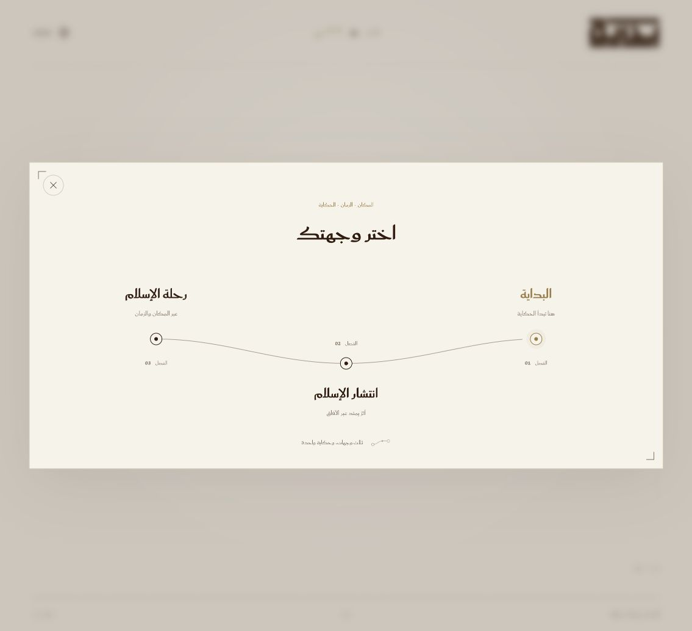

# Islamathon

An Arabic-first, bilingual web experience for exploring the Sirah in place and time. Built with React and TypeScript, it combines the Islamathon design (animated navigation, reading preferences) with the Bidaya data package.

**Status:** working prototype (v11). The Journey page tells the Sirah as a scroll-driven story: an opening scene, then chapters you scroll through while the map beside them follows each event, places glowing as Islam reaches them, a question at the end of each chapter (answered on the map), walks along the Hijrah, Ta'if and Farewell Hajj routes, and a closing summary of your progress. "Ask the map" floats over the map. All content is read at runtime from the CSV files at the repository root; `/spread` redirects to Journey.

## Editing the data

Every piece of content comes from the CSV files at the **root of this repository** (one folder up). Nothing is written into the code or the HTML. The dev and preview servers serve them at `/data/`, and `npm run build` copies them into `dist/data/`.

1. Open the CSV in Excel (or any spreadsheet app). Keep the header row and column names unchanged.
2. Edit, then save as **CSV UTF-8**.
3. Reload the page. While `npm run dev` is running, changes show on reload; on a deployed site, replace the file on the host. No rebuild is needed.
4. Run `npm test` to check the data. It loads every file and reports broken references (for example an event whose `رمز_المكان` is missing from `4_places.csv`). The browser console shows the same warnings with a `[data]` prefix.

| File | What it controls |
| --- | --- |
| `2_sirah_events.csv` | Events, their order (`ترتيب_العرض`), dates, places, coordinates and location precision |
| `12_dorar_titles_and_texts_ar_en.csv` | English titles and texts for each event |
| `4_places.csv` | Place names and coordinates |
| `1_related_surahs.csv` | Surah and verse records shown on event cards |
| `3_links_surahs_sirah.csv` | How each verse record attaches to the timeline (direct, context, stage, placeholder…) |
| `6_sahaba.csv` | Companions and their cited synopses |
| `5_sirah_map.geojson` | Sirah routes (Hijrah, Isra', Taif, Tabuk, Farewell Hajj) |
| `map_labels.csv` | Period map labels: regions (`إقليم`), powers (`قوة`), seas (`بحر`); position, size (`كبير`/`متوسط`/`صغير`) and rotation |
| `map_routes.csv` | Caravan routes, as `lat lon; lat lon; …` |
| `quiz.csv` | The first question at the end of each chapter (answer and choices are place keys). "Another question" then draws on questions built from the events (`src/data/quiz.ts`): "where did this happen?", answered by the event's exact place in `2_sirah_events.csv`, quoting the first sentence of its Dorar text. Events whose title already names a place are skipped |
| `route_stops.csv` | The stops of each route walk, with their Dorar lines |

The README of the data package (IslamthonDataandstuff) explains every column.

## How the story works

- **The story toolbar** stays at the top: jump to a chapter (✓ once its question is answered), take a quiz, and Ask the map. The first chapter returns to the beginning; the site header contains the single language switch.
- **Scrolling drives the map.** The step crossing the middle of the screen (the lower part on phones) becomes the current one. Over the map the wheel scrolls the story; zoom with the + / − buttons, a pinch, or Ctrl/⌘ + wheel.
- **Story mode** advances one step every few seconds and pauses at each chapter question until it is answered.
- **Progress** (answers and events read) is kept in this browser only (`localStorage`, key `bidaya.journey.v1`); the opening is shown once per browser session.
- **Reduced motion** (system setting or the in-app preference) turns off the drawing, pulses, caravans and smooth scrolling.

## The map

The map is a period map, drawn as SVG: coastlines only (Natural Earth 1:50m, public domain), with the regions, powers and seas of the time from `map_labels.csv`. It draws no modern borders, so no country outline is approximated. Region positions are approximate and labelled for orientation only; a region the sources say Islam reached is named in gold, and only places glow, at their own coordinates. The mountain marks along the Hijaz and Sarawat are decorative and approximate. To regenerate the coastline after changing the map's extent, run `node scripts/build-land.mjs`.

## Reading the verses

Each verse reference on an event card is a button that opens the verses from Quranpedia (`quranpedia.net/embed`) in a reader window, with a link to open them on Quranpedia directly. English opens Quranpedia's translations view. Ranges of up to 20 ayat open whole; longer ones open at their first ayah (`src/data/quranpedia.ts`).

## Companions

Names of the Companions in `6_sahaba.csv` are linked where they appear in the event texts and verse explanations (first mention per passage), and in the event card's Companion list. A link opens the Companion's cited summary and the events they appear in; choosing an event jumps to it. Matching (`src/data/people.ts`) works across Arabic diacritics and أبو/أبي/أبا, and across Dorar's English spellings. First names that are also common words or shared with other people (علي، عمر، عمرو…) link only as part of a full name. A new row in `6_sahaba.csv` is picked up automatically.

## Ask the map

`src/assistant/answer.ts` answers from the sources only: Dorar event texts, the Companions' synopses and the verse records. Each answer names its source and moves the map to the event. Questions asking for a ruling are referred to an official fatwa body, and questions with no matching source get an apology (deck slides 5–7). It runs in the browser, with no API key. To add an LLM later, send the passages from `retrieve()` to a server-side model and keep these rules.



## Features

- **Arabic and English:** mirrored right-to-left and left-to-right layouts with translated interface text.
- **Three destinations:** The Beginning, Spread of Islam, and Islam Journey.
- **Animated navigation:** logo transitions, a waypoint menu, browser Back/Forward support, and direct page URLs.
- **Reading preferences:** text scaling, line and character spacing, contrast themes, Saudi/Plex fonts, highlighted links, and stronger focus indicators.
- **Keyboard support:** menu and dialog focus management, Escape dismissal, and keyboard-operable preference controls.
- **Reduced motion:** respects the operating system preference and the in-app setting.
- **AI interaction demo:** animated question, processing, answer, cancel, and reset states.
- **AI responses and history:** the map pill keeps its size while the response uses the globe-to-card animation from the original Islamathon UI. The enlarged AI icon opens the last 50 question/answer pairs, saved in this browser under `bidaya.chats.v1`, with a clear-history action. When storage is unavailable, history works for the current visit. Long responses scroll inside their card; reduced motion is supported.
- **Local fonts:** typography assets are bundled with the application; no font CDN is required at runtime.

## Technology

| Area | Tools |
| --- | --- |
| Interface | React 19, TypeScript 5.9 |
| Development and build | Vite 7 |
| Tests | Vitest 5, jsdom |
| Styling and motion | CSS, SVG, browser animation APIs |
| Navigation | Browser History API |

## Getting started

### Prerequisites

- **Node.js 24.x** and its bundled npm. This version supports the development, build, and test dependencies in the lockfile.
- Git for cloning the repository.
- A modern browser.

No database, API key, environment file, or backend service is required to run the prototype.

### Install and run

```sh
git clone https://github.com/elyasos/islamathon.git
cd islamathon
npm ci
npm run dev
```

Open the URL printed by Vite, normally **http://127.0.0.1:5173**. Vite may select another port if that port is already occupied. `npm ci` installs the dependency versions recorded in `package-lock.json`.

The interface opens in Arabic. Use the language control to switch to English and the destination menu to explore the pages.

### Commands

| Command | Purpose |
| --- | --- |
| `npm run dev` | Start the local development server with hot reload |
| `npm test` | Run the automated tests once |
| `npm run build` | Check TypeScript and generate the production build in `dist/` |
| `npm run preview` | Serve an existing production build locally |
| `npm exec vitest` | Run tests in watch mode during development |

To preview the production build:

```sh
npm run build
npm run preview
```

Open the printed preview URL, normally **http://127.0.0.1:4173**.

To test on another device on the same network:

```sh
npm run dev -- --host 0.0.0.0
```

Open the computer's local network address and the printed port on that device.

## Pages

| URL | Page | Current implementation |
| --- | --- | --- |
| `/` | The Beginning | Original hero, visual introduction, three-step tour, feature previews, source explanation, and direct Journey links |
| `/journey` | Islam Journey | The story: opening, chapters, event cards, spread of Islam, chapter questions, route walks, timeline, story mode, and Ask the map |

Arabic is the first-visit default. The selected language is remembered across reloads in this browser; when storage is unavailable it still works for the current visit. Leaving Journey and returning starts a fresh AI demo.

Unknown URLs show a bilingual 404 page with Home and Start Journey links. Journey requests time out after 12 seconds and offer Try again, Reload page, and Home if content is unavailable. Unexpected page-render failures use the same recovery screen, and failed landing previews show descriptive text.

## Project structure

```text
src/
├── App.tsx                   # Shared shell, language, and viewport handling
├── main.tsx                  # React entry point
├── i18n.ts                   # Arabic and English interface copy
├── index.css                 # Global styles and reading preferences
├── accessibility/            # Preferences provider and settings dialog
├── assets/                   # Source logo asset
├── components/               # Brand logo, AI orb, and map placeholder
├── navigation/               # Routes, history handling, menu, and transitions
└── pages/                    # Landing/chapter titles and Journey page
public/
├── favicon.svg
└── fonts/                    # Saudi font files and source notices
qa/                           # Saved browser-review screenshots
Logo.svg / Logo.png           # Original supplied brand assets
*.textClipping                # Original supplied animation references
```

Tests live alongside the relevant components and navigation modules. The supplied `globe effects.textClipping` reference is currently unused.

## Configuration and integration

### Reading preferences and storage

Validated reading settings are saved in the browser's `localStorage` under `islamathon.accessibility.v1`. If storage is unavailable, settings continue to work in memory. Use the reset control in the settings dialog to restore defaults.

Questions and answers remain in component memory. The default AI demo does not send them to a backend.

### Connecting an AI service

`src/components/MorphOrb.tsx` exposes these optional props:

| Prop | Type | Purpose |
| --- | --- | --- |
| `locale` | `'ar' \| 'en'` | Interface language |
| `onSubmit` | `(text: string) => Promise<string> \| string` | Supply an answer from your integration |
| `minThinkMs` | `number` | Minimum processing animation duration |
| `speed` | `number` | Animation speed |
| `reducedMotion` | `boolean` | Override the component's system motion preference |

The current `JourneyPage` uses the localized demo answer. To connect a service, pass an `onSubmit` callback there and handle transport, errors, and request cancellation in your integration. Keep service credentials on a server; client-side Vite variables are visible to users.

Escape or Cancel stops the UI sequence and ignores late answers; it does not automatically cancel an external network request. Add `?debug` to the Journey URL to expose animation speed and replay controls.

## Production deployment

The application builds to static files:

```sh
npm ci
npm run build
```

Configure your hosting service with:

| Setting | Value |
| --- | --- |
| Build command | `npm run build` |
| Output directory | `dist` |
| Node version | `24.x` |
| Runtime environment variables | None for the current prototype |

**Configure an SPA fallback:** requests to `/spread` and `/journey` must serve `index.html` when no static file matches. Without that rewrite, refreshing an inner page may return a 404. Existing assets must continue to be served normally.

The default Vite base path is `/`. If hosting under a subdirectory, configure Vite's `base` and adapt route handling in `src/navigation/routes.ts` and `src/navigation/useNavigation.ts` to that prefix. The current routes assume hosting at the domain root.

`npm run preview` is intended for local build verification. No production hosting configuration or deployment is included in this repository.

## Verification

Run both checks before submitting changes:

```sh
npm test
npm run build
```

The current suite includes 69 tests across eight files, covering the data, AI lifecycle and cleanup, response-only animation under Strict Mode, chat history persistence and storage failures, navigation/history behavior, 404 recovery, Journey retries, page-render recovery, landing entry links and image fallbacks, language persistence and bounded transitions, the finite book animation, transition geometry, waypoint endpoints, reduced motion, preference persistence, dialog focus, and preference changes during AI processing.

With a local server running, `node scripts/check-ai-response.cjs http://127.0.0.1:5184` checks the real response animation, unchanged composer height, icon size, history persistence, clearing, keyboard dismissal, and Arabic/English desktop/mobile layouts. It requires Playwright and Chrome, as do the landing browser scripts.

Saved browser reviews in `qa/` cover desktop and mobile layouts, both languages, navigation, transitions, enlarged text, contrast themes, and compact viewports. These screenshots document prior reviews; they are not an automated browser test suite. A physical mobile keyboard and browser page zoom have not been verified.

## Troubleshooting

| Symptom | What to check |
| --- | --- |
| Installation fails or reports an unsupported engine | Check `node --version`; use Node 24.x, then run `npm ci` |
| The default development port is unavailable | Use the alternate URL printed by Vite, or run `npm run dev -- --port 5174` |
| A refreshed inner page returns 404 after deployment | Configure the host's SPA fallback to `index.html` |
| Ask the map apologises for a question | No source text matched it well enough; try the event, place or Companion name |
| The Journey page says the data could not be loaded | Check that the CSV files are at the repository root (or in `dist/data/` on a host) |
| Settings disappear after a reload | Browser storage may be unavailable or disabled; settings then last only for the session |
| Animations are reduced | Check the operating system motion setting and the in-app reading preferences |

## Contributing

Keep Arabic and English copy in sync, preserve mirrored layouts, and check keyboard focus and reduced-motion behavior when changing interactions. Include a clear explanation of your change and any relevant screenshots in a pull request. Run the test suite and production build before submitting.

## Assets and licensing

No project-wide software license has been selected. Third-party assets retain their own terms and notices.

Saudi Regular and Bold are provided unchanged from the Ministry of Culture source; embedded copyright and trademark notices are transcribed in [public/fonts/NOTICES.md](public/fonts/NOTICES.md). Fontsource dependencies carry their own license files. Review the applicable asset terms before redistribution or production use.

The map's texture (a water line along the coast, paper grain) is decorative only and carries no data.

The map carries an Ask bar (on wide screens it is the only way in; phones keep the toolbar button): type a question, or press Enter to ask the one it suggests for the current event. The answer appears in a card at the top of the story column, with the current event moved just below it (`suggestFor` in `src/assistant/answer.ts`; a question is only suggested after the answer engine has answered it from the sources). The suggested question keeps the reader on that event; a typed one moves the story to the event it is about.

## Deploying to Vercel

`vercel.json` at the repository root tells Vercel to install and build the app from `app/` (the data files at the root are copied into `app/dist/data/` during the build) and to serve `app/dist`. Its rewrite sends every page path (such as `/journey`) to `index.html`, so opening or refreshing a page never gives a 404; real files (`/assets/…`, `/data/…`) are served as they are. If the Vercel project's Root Directory is set to `app` instead, `app/vercel.json` does the same.

A person's card shows their cited summary, one line of its sources (Dorar events and Sahihayn hadith, from `7_sahaba_references.csv`), the sources' own words in a section that opens on request, then the events they appear in, each with the sentence of Dorar's text that names them.
